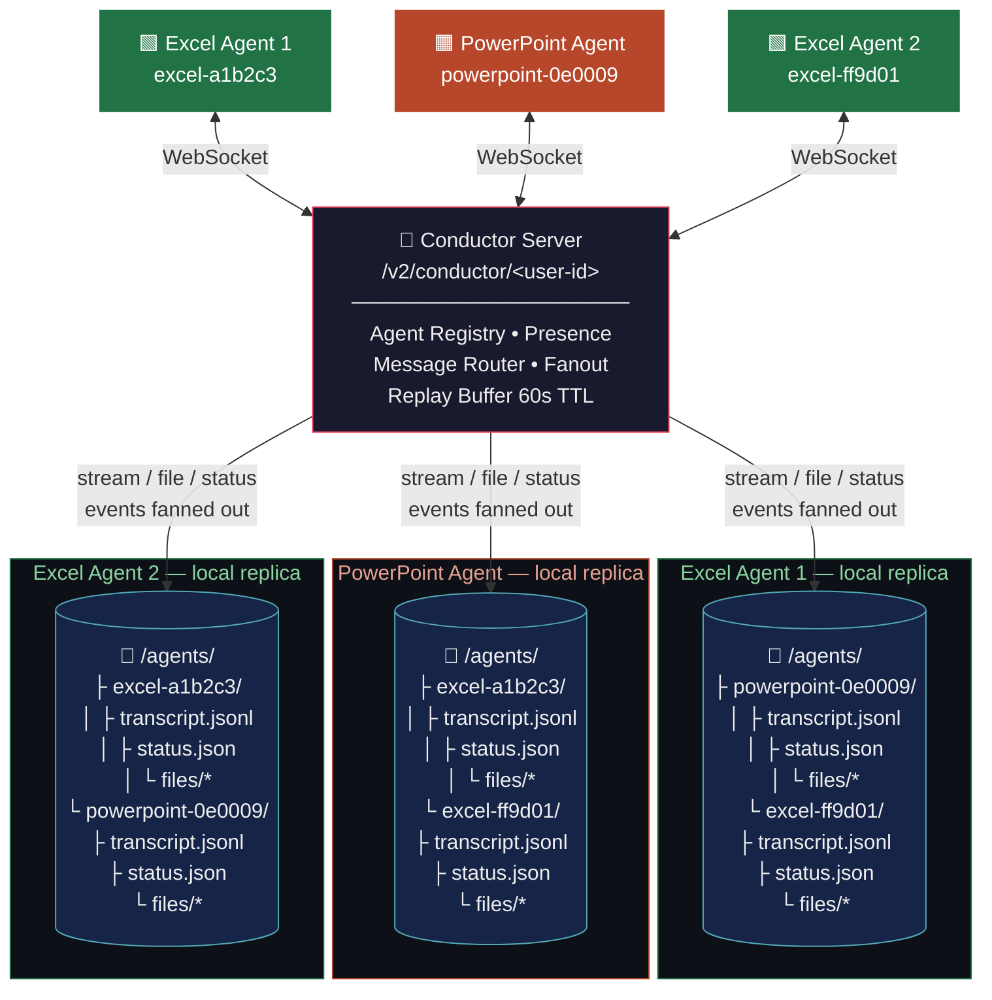
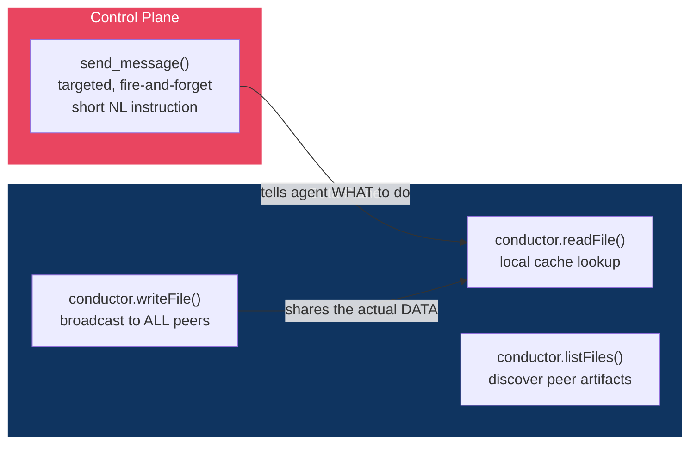
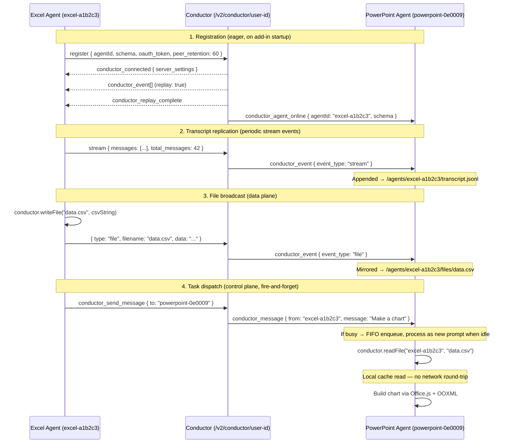
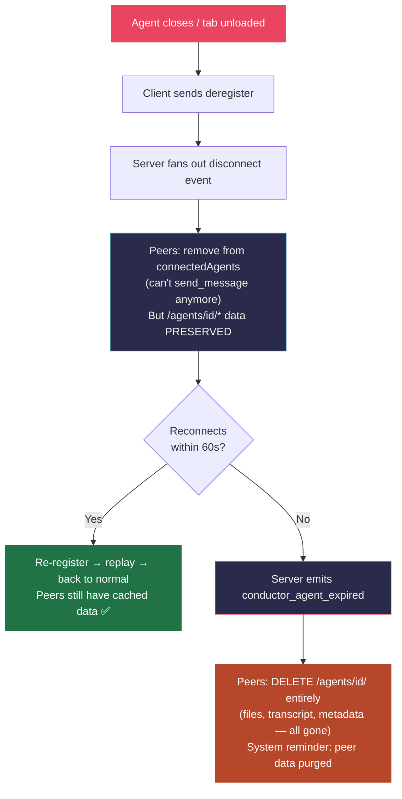
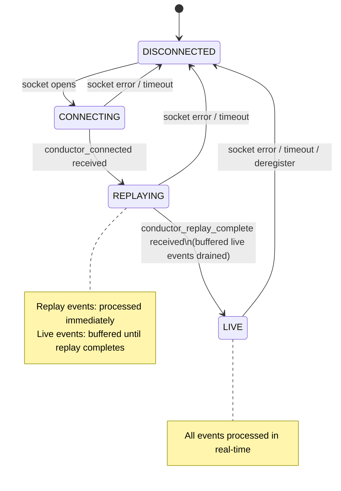

# Conductor protocol spec (reverse-engineered from client behavior)

Clean-room spec of the cross-agent communication protocol used by Claude's Office add-ins (Excel, PowerPoint, Word), reverse-engineered from `minified_bundle_2026-03-13.js`. Written entirely from the client-side implementation — no server source was available.

---

## 1. Architecture at a glance

Conductor is a **server-brokered WebSocket message bus** that lets Office add-in agents discover each other, exchange files, and dispatch tasks.

```text
┌──────────────┐   ┌──────────────────┐   ┌──────────────┐
│ Excel Agent 1 │   │ PowerPoint Agent │   │ Excel Agent 2 │
│ excel-a1b2c3  │   │ powerpoint-0e0009│   │ excel-ff9d01  │
└──────┬───────┘   └────────┬─────────┘   └──────┬───────┘
       │  WebSocket          │  WebSocket          │  WebSocket
       │  (JSON, muxed)      │  (JSON, muxed)      │  (JSON, muxed)
       ▼                     ▼                     ▼
┌─────────────────────────────────────────────────────────────┐
│              Conductor Server                               │
│              /v2/conductor/<user-id>                         │
│                                                             │
│  • Agent registry + presence tracking                       │
│  • Message routing (targeted) + broadcast fanout            │
│  • Replay buffer (peer_retention: 60s TTL)                  │
└─────────────────────────────────────────────────────────────┘
```

**Not P2P.** Agents never talk directly to each other. Every message flows through the central broker.



### What the broker does

1. **Presence/discovery** — agents register on startup; peers learn about each other
2. **Directed async messaging** — fire-and-forget `send_message` for task dispatch (control plane)
3. **Broadcast state replication** — transcript, status, and file events are fanned out to all peers, who build local materialized views (data plane)
4. **Short-lived replay** — reconnecting clients can rebuild their local view from retained state

> A concise label: **brokered pub/sub + directed messaging + short-lived replay**

### Control plane vs data plane

Conductor separates *what to do* from *the data to do it with*:

| | Tool | Purpose | Delivery |
|---|---|---|---|
| **Control plane** | `send_message` | Short natural-language task instruction | Targeted to one peer |
| **Data plane** | `conductor.writeFile()` | Share artifacts (JSON, CSV, XML, etc.) | Broadcast to all peers |

The intended pattern:
1. `conductor.writeFile("data.csv", csvString)` — publish the artifact
2. `send_message("Make a chart from data.csv")` — tell a specific agent what to do with it

`writeFile` alone does **not** trigger agent work. `send_message` alone does **not** carry large payloads. They're complementary.



### The virtual filesystem is a LOCAL replica

Every agent maintains its own **in-memory copy** of every other peer's state. When Excel Agent 1 broadcasts a file, it doesn't land in one central filesystem — it gets replicated into each peer's local VFS independently.

```text
Excel Agent 1's local VFS:          PowerPoint Agent's local VFS:
/agents/                             /agents/
├── powerpoint-0e0009/               ├── excel-a1b2c3/
│   ├── transcript.jsonl             │   ├── transcript.jsonl
│   ├── metadata.json                │   ├── metadata.json
│   ├── status.json                  │   ├── status.json
│   └── files/                       │   └── files/
│       └── chart.xml                │       └── data.csv
└── excel-ff9d01/                    └── excel-ff9d01/
    ├── transcript.jsonl                 ├── transcript.jsonl
    ├── metadata.json                    ├── metadata.json
    ├── status.json                      ├── status.json
    └── files/                           └── files/
```

Each agent sees every peer **except itself**. The VFS is exposed via a sandboxed read-only `bash` (only `head`, `tail`, `grep`, `jq`, `cat`, etc. — not a real shell).

All reads are local. `conductor.readFile("excel-a1b2c3", "data.csv")` hits the in-memory cache — no network round-trip. `get_connected_agents` returns the local peer cache — no server call.

---

## 2. Agent lifecycle

### 2.1 Birth: registration

Registration is **eager** — it happens immediately on add-in startup, not lazily on first use.

```text
DISCONNECTED → CONNECTING → [socket opens] → send register → REPLAYING → LIVE
```

On socket open, the client sends:

```json
{
  "type": "register",
  "agentId": "powerpoint-0e0009",
  "schema": { ...normalized schema... },
  "oauth_token": "...",
  "peer_retention": 60,
  "_agent_id": "powerpoint-0e0009"
}
```

In development mode, `dev_user_id` is sent instead of `oauth_token`.

The server then:
1. Sends `conductor_connected { server_settings }` — client enters `REPLAYING` state
2. Replays retained peer state as `conductor_event` packets with `replay: true`
3. Sends `conductor_replay_complete { events_replayed: N }` — client enters `LIVE` state
4. Notifies other peers via `conductor_agent_online { agentId, schema }`

During `REPLAYING`, the client processes replay events immediately. Any live events that arrive during replay are buffered, then drained in arrival order once replay completes.

### 2.2 Steady state: broadcasting and messaging

While alive, agents broadcast three state channels to all peers:

| Channel | Wire type | Mirrored to | Trigger |
|---|---|---|---|
| **Transcript** | `stream` | `/agents/<id>/transcript.jsonl` | Periodic, after conversation updates |
| **Status** | `status` | `/agents/<id>/status.json` | On document changes (filename, URL) |
| **Files** | `file` | `/agents/<id>/files/<name>` | On `conductor.writeFile()` call |

Agents can also send targeted messages via `conductor_send_message`, which the broker routes to the recipient as `conductor_message`.

The following sequence shows the full lifecycle — registration, transcript replication, file broadcast, and task dispatch:



### 2.3 Context clear (soft reset)

When an agent clears its conversation context:

```json
{ "type": "clear_context", "_agent_id": "powerpoint-0e0009" }
```

The server translates this into `conductor_agent_reset` for all peers. On receiving this, peers:
- **Immediately** clear that agent's transcript and files from their local VFS
- Surface a system reminder: "peer cleared its context"

The agent itself remains registered and online — only its conversation state is wiped.

### 2.4 Death: disconnect → grace window → expiry

Agent shutdown is a **two-phase process**, not an instant purge.

**Phase 1: Disconnect.** The agent closes (tab closed, add-in unloaded). The client sends `deregister`. The server fans out a `disconnect` event to peers.

What happens on peers:
- The agent is removed from `connectedAgents` (no more `send_message` to it)
- But `/agents/<id>/*` data **remains intact** in the local VFS

**Phase 2: Expiry.** After `peer_retention` seconds (observed: 60s) with no reconnect, the server emits:

```json
{ "type": "conductor_agent_expired", "agentId": "excel-a1b2c3" }
```

What happens on peers:
- `/agents/excel-a1b2c3/` is **deleted** from the local VFS (files, transcript, metadata — everything)
- A system reminder surfaces: "peer data expired and was purged"

**Why the grace window exists:** If the agent just had a momentary disconnect (browser froze, sleep/wake, network blip), it can reconnect and re-register within 60 seconds. The server replays its retained state, peers still have the cached data, and nothing is lost. Only after the TTL expires does the system commit to cleanup.



There is also a `conductor_agent_offline` server event, but the observed client code does not meaningfully process it — disconnect handling is driven by the `disconnect` event type within `conductor_event` and the expiry flow above.

---

## 3. Agent identity

### 3.1 Agent ID format

```text
<interface>-<random6hex>
```

Examples: `excel-a1b2c3`, `powerpoint-0e0009`, `word-ffee11`

A fresh ID is generated per runtime session (not persisted across restarts).

Validation regex: `^[a-zA-Z0-9][a-zA-Z0-9._-]{0,99}$`

### 3.2 Schema

Each agent registers a schema describing its identity and capabilities:

```json
{
  "instructions": "...",
  "appName": "powerpoint",
  "version": 2,
  "interface": "powerpoint",
  "capabilities": {
    "receive_message": {},
    "file_sharing": {
      "accept": ["json", "xml", "txt", "md", "svg"]
    }
  },
  "display": {
    "label": "powerpoint",
    "color": "#B7472A"
  }
}
```

- `version` is observed as `2`
- `display` defaults to `{ label: <app label> }` if absent
- `capabilities` defaults to `{ receive_message: {} }` if absent

### 3.3 Accepted file formats per surface

| Surface | Interface | Accepted formats |
|---|---|---|
| Excel | `sheet` | `csv`, `tsv`, `json`, `xml`, `txt`, `md` |
| PowerPoint | `slide` | `json`, `xml`, `txt`, `md`, `svg` |
| Word | `doc` | `txt`, `md`, `html`, `json`, `xml` |

These are declared in `capabilities.file_sharing.accept` and tell sending agents what formats the receiver can parse.

---

## 4. Transport layer

### 4.1 WebSocket endpoint

```text
<vhost>/v2/conductor/<user-id>
```

`<user-id>` is the authenticated user ID, or `dev_user_local` in local development.

### 4.2 Connection behavior

- JSON encode/decode on the wire
- Automatic reconnect with exponential backoff
- Heartbeat-based liveness detection
- Zombie connection detection on sleep/wake via visibility-change events

Observed timing defaults:

| Parameter | Value |
|---|---|
| Reconnect base delay | 2000 ms |
| Reconnect max delay | 30000 ms |
| Ping interval | 30000 ms |
| Pong staleness timeout | 90000 ms |
| Visibility-change pong timeout | 5000 ms |

### 4.3 Heartbeat

Client sends `{ "type": "ping" }`, server replies `{ "type": "pong" }`. If pongs stop arriving, the client closes the socket and reconnects.

### 4.4 Multiplexing

One physical WebSocket can carry multiple logical agent transports. Every outbound message is tagged with `_agent_id`. Inbound messages may include:

- `_for_agent_id` — deliver only to that logical agent
- `_exclude_agent_id` — deliver to all logical agents on the socket except one
- neither — deliver to all logical agents on the socket

This is a browser runtime concern. A server reimplementation can treat these as logical addressing metadata.

---

## 5. Transcript replication

Transcript sync deserves its own section because the semantics are only partially observable from client code.

### What's known

Conversation updates are broadcast via `stream` events:

```json
{
  "type": "stream",
  "messages": [ ...conversation messages... ],
  "total_messages": 42,
  "full_sync": true,
  "_agent_id": "powerpoint-0e0009"
}
```

Peers mirror these to `/agents/<sender-id>/transcript.jsonl`.

### What's ambiguous

The spec author could observe:
- `full_sync` appears on reset/reconnect cases
- The word "new" is used in the codebase when describing periodic sync
- `total_messages` is included (useful for gap detection in an incremental model)

But could **not** definitively confirm from client code alone whether normal (non-reset) syncs send:
- **(a)** only new messages since last sync (incremental), or
- **(b)** the full transcript every time (with `full_sync` just being a flag for resets)

The presence of `total_messages` and the "new conversation messages" phrasing **suggests incremental with full-sync fallback**, but this is inference, not proof.

### What's certain

- On context clear or reconnect, sync restarts from zero and may set `full_sync: true`
- `bash` calls that inspect `/agents/...` are filtered out of transcript sync (prevents echoing conductor-inspection chatter back to peers)
- Transcripts are ephemeral — subject to the same retention/expiry as all conductor state

---

## 6. Message delivery

### 6.1 Sending

```ts
sendMessage(agentId: string, message: string, files?: Record<string, string>): Promise<"ok">
```

Wire format:

```json
{
  "type": "conductor_send_message",
  "to": "powerpoint-0e0009",
  "message": "Please add a title slide.",
  "_agent_id": "excel-a1b2c3"
}
```

The lower-level API supports optional inline `files`, but the user-facing `send_message` tool only exposes `agent_id` and `message`. In practice, artifact exchange is done through `conductor.writeFile()` + `send_message`, not inline attachments.

Validation:
- Cannot send to self → `"Cannot send message to self"`
- If target lacks `capabilities.receive_message` → `"Agent \"<id>\" cannot receive messages (send-only client). Do not attempt to message it."`

**Fire-and-forget.** No correlation ID, no synchronous response. Success means accepted by the local client for delivery, not that the peer received or completed it.

### 6.2 Receiving

The server delivers messages as:

```json
{
  "type": "conductor_message",
  "from": "excel-a1b2c3",
  "message": "Please add a title slide.",
  "files": { "data.json": "{...}" }
}
```

The receiving client:
1. Appends the message to an incoming **FIFO queue**
2. **Waits until idle** (not mid-turn, not processing another message)
3. Injects system reminders about the sender and reply expectations
4. Persists any attached files to conductor cache/VFS
5. Invokes the local agent query loop with the message text as a **new prompt**

**Key implication:** An inbound message becomes a new agent task/prompt, not a typed function call. Messages received while the agent is busy are queued and processed serially when the agent becomes idle.

---

## 7. `conductor.*` runtime API

Available inside `execute_office_js` and OOXML editing sandboxes:

```ts
conductor.writeFile(name: string, data: string): void
conductor.readFile(agentId: string, name: string): string | null
conductor.listFiles(agentId: string): string[]
```

### `writeFile`

**Broadcast publish** to all connected peers (not point-to-point).

- Validates filename (same regex as agentId: `^[a-zA-Z0-9][a-zA-Z0-9._-]{0,99}$`)
- Sends a `file` event through the broker
- Mirrors to `/agents/<self>/files/<name>` on all peers
- Requires an active connection → `"Conductor client not connected — cannot broadcast file"` if disconnected

Does **not** by itself trigger agent work, create a task, or invoke a message handler. It's artifact publication — combine with `send_message` for task dispatch.

### `readFile`

**Local cache read only.** Returns file contents from the in-memory peer file cache (populated by prior broadcasts/replay), or `null`. No network fetch.

### `listFiles`

Returns known filenames for a given peer, or `[]`. Also a local cache read.

### Persistence model

All conductor state is **ephemeral**:
- Not saved into the document
- Not guaranteed across sessions
- Subject to `peer_retention` TTL expiry on the server

---

## 8. User-facing tools

### 8.1 `get_connected_agents`

Input: `{}`

Returns the **locally cached** peer list (no network call):

```json
[
  {
    "agentId": "powerpoint-0e0009",
    "schema": {
      "instructions": "...",
      "label": "powerpoint",
      "version": 2,
      "interface": "powerpoint",
      "capabilities": {
        "receive_message": {},
        "file_sharing": { "accept": ["json", "xml", "txt", "md", "svg"] }
      },
      "display": { "label": "powerpoint", "color": "#B7472A" }
    }
  }
]
```

### 8.2 `send_message`

Input: `{ "agent_id": "powerpoint-0e0009", "message": "Please add a title slide." }`

Success:
```json
{
  "status": "delivered",
  "agent_id": "powerpoint-0e0009",
  "instruction": "Message delivered. The other agent is now working on your request. End your turn and tell the user you're waiting for a response. You will be notified when the agent replies."
}
```

Errors:
- `"agent_id and message are required"`
- `"Conductor not connected. The bridge feature must be enabled."`
- `"Cannot send message to self"`
- `"Agent \"<id>\" cannot receive messages (send-only client). Do not attempt to message it."`

### 8.3 Virtual `bash`

A sandboxed, read-only shell scoped to `/agents/`. Only supports: `cat`, `head`, `tail`, `wc`, `grep`, `rg`, `find`, `cut`, `sort`, `uniq`, `jq`, `ls`, `diff`, and similar read-only utilities. No `awk`, `sed`, `echo`, `curl`, `python`, or write operations.

Purpose: peek at peer state cheaply before deciding whether to use `send_message`.

```bash
head -5 /agents/excel-a1b2c3/files/data.csv    # inspect structure
grep 'revenue' /agents/excel-a1b2c3/transcript.jsonl  # search history
```

---

## 9. Wire protocol reference

### 9.1 Client → server

| Type | Purpose | Key fields |
|---|---|---|
| `register` | Register agent, begin replay | `agentId`, `schema`, `oauth_token`, `peer_retention` |
| `deregister` | Remove agent transport | `_agent_id` |
| `stream` | Broadcast transcript updates | `messages`, `total_messages`, `full_sync` |
| `file` | Broadcast a shared file | `filename`, `data` |
| `status` | Broadcast status metadata | `fileName`, `documentUrl` |
| `clear_context` | Signal context was cleared | |
| `activate` | Request UI focus on a peer | `target_agent_id` |
| `conductor_send_message` | Send targeted message | `to`, `message`, optional `files` |
| `ping` | Heartbeat | |

All client messages are wrapped with `_agent_id` for multiplexing.

### 9.2 Server → client

| Type | Purpose | Key fields |
|---|---|---|
| `pong` | Heartbeat response | |
| `conductor_connected` | Connection established, replay starting | `server_settings` |
| `conductor_event` | Replay or live event envelope | `event_type`, `agent_id`, `payload`, `timestamp`, `replay` |
| `conductor_replay_complete` | Replay finished | `events_replayed` |
| `conductor_agent_online` | Peer connected | `agentId`, `schema` |
| `conductor_agent_offline` | Peer disconnected (observed but not meaningfully processed) | `agentId` |
| `conductor_message` | Inbound direct message | `from`, `message`, optional `files` |
| `conductor_agent_reset` | Peer cleared context | `agentId` |
| `conductor_agent_expired` | Peer state purged after TTL | `agentId` |
| `conductor_error` | Server error | `error` |
| `activate` | Inbound UI focus request | `from`, `target_agent_id` |

### 9.3 `conductor_event` subtypes

The `conductor_event` envelope wraps replay and live events with a unified shape:

```json
{
  "type": "conductor_event",
  "event_type": "connect | status | file | stream | disconnect",
  "agent_id": "excel-a1b2c3",
  "payload": { ... },
  "timestamp": 1710000000000,
  "replay": true,
  "disconnected": false
}
```

| `event_type` | Payload | Client behavior |
|---|---|---|
| `connect` | Peer schema | Add to `connectedAgents`, write metadata.json |
| `status` | `{ fileName, documentUrl }` | Mirror to `/agents/<id>/status.json` |
| `file` | `{ filename, data }` | Mirror to `/agents/<id>/files/<name>` + in-memory cache |
| `stream` | `{ messages, total_messages, full_sync }` | Mirror to `/agents/<id>/transcript.jsonl` |
| `disconnect` | (none) | Update peer registry |

---

## 10. Client state machine



---

## 11. Peer retention and replay

### What `peer_retention: 60` means

This is **not** "replay all events from the last 60 seconds." It's a **TTL for retained peer state on the server**.

The server retains enough state per peer (schema, status, files, possibly transcript) to allow a reconnecting client to rebuild its local VFS from replay. After 60 seconds with no reconnect, that retained state is purged and `conductor_agent_expired` is emitted.

Evidence for this interpretation:
- The field is named `peer_retention`, not `event_window`
- Expiry triggers `conductor_agent_expired`, which purges peer data on clients
- Replay is used to rebuild derived peer state, not to re-process events

### Server-side replay model (inferred)

On `register`:
1. Bind socket to `agentId`
2. Send `conductor_connected`
3. Replay retained peer state as `conductor_event` packets with `replay: true`
4. Send `conductor_replay_complete`
5. Notify other peers via `conductor_agent_online`

---

## 12. Implementing a compatible server

A compatible server needs:

1. WebSocket session handling + heartbeat pong
2. Agent registration scoped per user
3. Peer discovery and online/offline notifications
4. Retained state per peer with configurable TTL
5. Replay on registration
6. Routing for `conductor_send_message` → `conductor_message`
7. Fanout of `stream`, `file`, `status`, `clear_context`, `activate`
8. Expiry/purge after retention timeout → `conductor_agent_expired`

Suggested per-user data model:

```
agents: Map<agentId, {
  connection,
  schema,
  status,
  files: Map<filename, data>,
  transcript: Message[],
  lastSeen: timestamp
}>
```

> **Editorial note:** this strongly smells like a Redis pub/sub + streams setup on the server side, but that's speculation — no server code was examined.

---

## 13. Caveats

1. This spec is reverse-engineered from client code. Server behavior is inferred.
2. `send_message` has **no correlation ID** — don't build request/response semantics on it.
3. `get_connected_agents` is a cache view. `conductor.readFile()` is a local cache read. Neither hits the network.
4. All conductor state is ephemeral and explicitly expirable.
5. The communication model is **agent-task dispatch** (natural language prompts), not typed RPC.
6. Transcript sync semantics (incremental vs full) are ambiguous from client observation alone — see §5.
